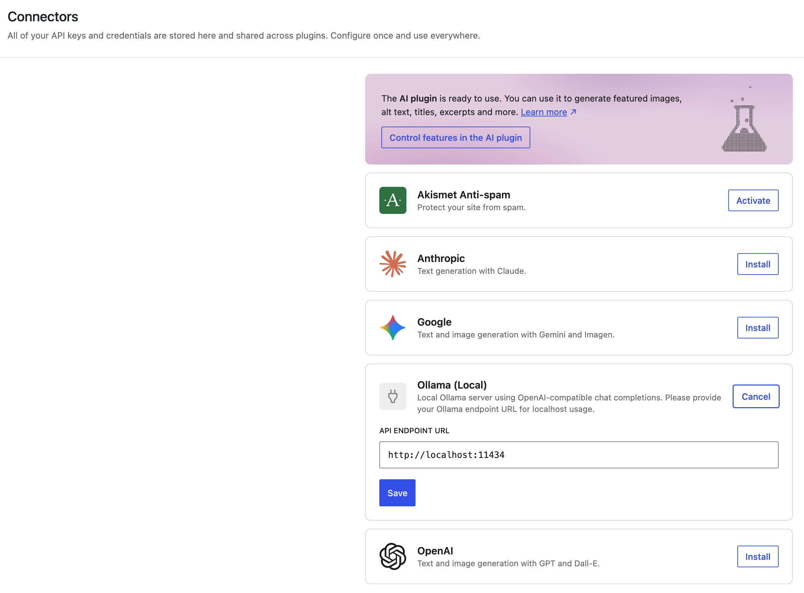

# WordPress Ollama Provider for Local AI (OpenAI-Compatible)

[](https://wordpress.org/plugins/ai/)
[](https://ollama.com)
[](#why-local-ai-matters)
[](#architecture-overview)

Connect your **WordPress AI plugin** to **Ollama** in minutes and run a private, **self-hosted AI** workflow with your own **local LLM** models.

This plugin is a production-minded **AI provider** for WordPress that uses Ollama's OpenAI-compatible API while keeping prompts and responses in your own environment.

Keywords: **WordPress Ollama**, **Local AI**, **Self-hosted AI**, **OpenAI compatible**, **Offline AI**, **Private AI**, **Ollama provider**.

## What This Is

`AI Provider for Local Ollama` registers `ollama_local` as a provider in the WordPress Connectors ecosystem so your site can use local models through Ollama instead of sending traffic to cloud-only APIs.

## Why Developers Use It

- Private by default: keep content in your local network or self-hosted infrastructure.
- Lower recurring cost for routine generation tasks.
- OpenAI-compatible request shape (`/v1/chat/completions`) for familiar tooling.
- Dynamic model discovery from Ollama (`/api/tags`).
- Endpoint health validation to reduce false "connected" states.
- Automatic default model selection from discovered local models.

## Screenshots

Connector setup and connected state visuals:



Replace these placeholders with real screenshots as your UI evolves.

## Animated Demo (GIF)

- Planned demo path: `assets/demos/local-run.gif`
- Suggested flow:
1. Open `wp-admin/options-connectors.php`
2. Enter `http://localhost:11434`
3. Save connector settings
4. Show successful connected state
5. Generate AI Content

## Quick Start (Under 5 Minutes)

1. Install and activate the [WordPress AI plugin](https://wordpress.org/plugins/ai/).
2. Install and run [Ollama](https://ollama.com/download).
3. Pull a model locally:

```bash
ollama pull qwen2.5:7b
```

4. Confirm Ollama is reachable:

```bash
curl http://localhost:11434
curl http://localhost:11434/api/tags
```

5. Activate this plugin.
6. In WordPress admin, open `Settings > Connectors` (`wp-admin/options-connectors.php`).
7. Configure endpoint as `http://localhost:11434` and save.

## Local Ollama Setup Guide (Step-by-Step)

Use this if you are new to Ollama or want to verify your local setup before connecting WordPress.

1. Start Ollama runtime:

```bash
ollama serve
```

2. Check Ollama server health:

```bash
curl http://localhost:11434
```

Expected output should include `Ollama is running`.

3. Pull a model:

```bash
ollama pull qwen2.5:7b
```

4. Verify model list from Ollama API:

```bash
curl http://localhost:11434/api/tags
```

5. Confirm your model appears in `models`.
6. In WordPress Connectors, set endpoint to `http://localhost:11434` and save.

If Ollama is hosted on another machine, use that reachable host and port instead (example: `http://192.168.1.10:11434`).

## Installation

### 1) WordPress Plugin Setup

- Copy this repository into your plugins directory.
- Activate **AI Provider for Local Ollama** in WordPress admin.

### 2) Ollama Setup

macOS:

```bash
brew install ollama
ollama serve
ollama pull qwen2.5:7b
```

Linux:

```bash
curl -fsSL https://ollama.com/install.sh | sh
ollama serve
ollama pull qwen2.5:7b
```

Windows:

- Install from [ollama.com/download](https://ollama.com/download)
- Launch Ollama and run model pull in terminal:

```bash
ollama pull qwen2.5:7b
```

## Supported Models

Any Ollama model that appears in:

```bash
curl http://localhost:11434/api/tags
```

Examples:

- `qwen2.5:7b`
- `llama3.1:8b`
- `mistral:7b`

## Use Cases

- Private editorial drafting in WordPress.
- Internal knowledge and content generation with **offline AI** workflows.
- Cost-controlled experimentation with local model swaps.
- Development environments requiring no external AI API keys.

## Why Local AI Matters

Cloud APIs are excellent for many workloads, but local/self-hosted AI is often preferred when teams need:

- Stronger data locality and privacy guarantees.
- Predictable cost for high-frequency usage.
- Independence from third-party API outages.
- Control over model choice and upgrade timing.

## Local Ollama vs Cloud API Providers

| Capability | Local Ollama Provider | Cloud OpenAI-Style APIs |
|---|---|---|
| Data control | High (self-hosted/private) | Lower (external service) |
| Marginal usage cost | Usually lower after setup | Per-token billing |
| Setup effort | Moderate | Low |
| Latency | Depends on local hardware | Depends on network/region |
| Internet dependency | Optional | Required |

## Architecture Overview

```text
WordPress AI Plugin
  -> Connectors API
    -> ollama_local provider (this plugin)
      -> Ollama endpoint (http://localhost:11434)
        -> /api/tags (model discovery)
        -> /v1/chat/completions (generation)
```

Core files:

- `ai-provider-for-local-ollama.php`
- `includes/class-ollama-provider.php`
- `includes/class-ollama-model-metadata-directory.php`
- `includes/class-ollama-text-generation-model.php`
- `includes/admin-connectors-ui.js`

## Reliability and Safety Notes

- Endpoint is normalized to `http(s)://host[:port]`.
- Path/query/fragment/user-info are dropped.
- Health checks gate connected state.
- Settings updates are capability-gated.

## Troubleshooting

### Connector connected, but generation fails

- Confirm Ollama process is running.
- Verify endpoint in connector settings: `http://localhost:11434`
- Confirm at least one model exists:

```bash
curl http://localhost:11434/api/tags
```

### No model supports `text_generation`

- Ensure `/api/tags` returns non-empty `models`.
- Re-save connector endpoint to refresh default model selection.

### UI still shows API-key wording

- Hard refresh browser.
- Reopen connectors page.
- Confirm plugin is active and admin JS loaded.

## Contributing

Contributions are welcome. For now:

1. Open an issue with reproduction details.
2. Keep pull requests focused and minimal.
3. Include before/after behavior notes for connector and model discovery flow.

(Planned: dedicated `CONTRIBUTING.md`, templates, and CI checks.)

## Roadmap

- Add dedicated docs pages for architecture and development.
- Add issue/PR templates and contributor guidelines.
- Add Markdown/documentation lint workflow.
- Add richer demo assets (real screenshots + setup GIF).
- Add release checklist and semantic versioning guidance.

## Star History

If this plugin helps your local WordPress AI workflow, a star helps discovery and signals demand for continued maintenance.

## Version

Current plugin header version: `0.2.0`
